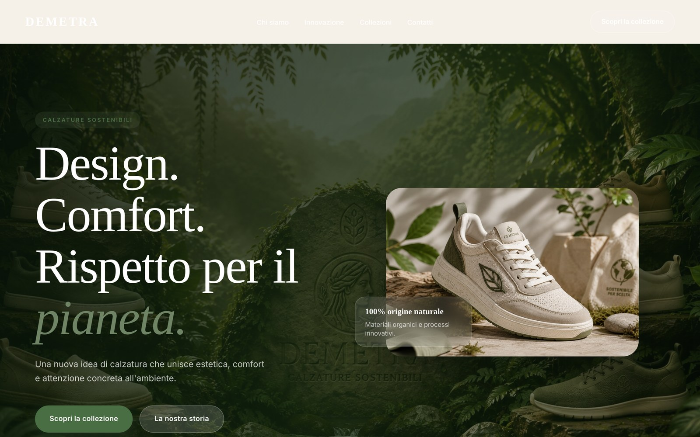

# Demetra — Landing page per un brand di calzature sostenibili

> **Esercizio didattico.** Demetra è un brand di fantasia. Questa pagina è stata realizzata come progetto del modulo *Introduzione allo Sviluppo* del corso Full Stack Development & AI Agents di [Start2Impact University](https://www.start2impact.it/), a scopo esclusivamente formativo. Non rappresenta un'azienda reale, non è collegata ad alcuna società esistente e i contenuti — nome, testi, certificazioni e dati citati — sono inventati a fini di esercitazione.

**[→ Guarda la demo live](https://rafeola.github.io/landing-page-demetra/)**



---

## Il progetto

Landing page one-page per un brand immaginario di calzature sostenibili, sviluppata interamente in **HTML5 e CSS3**, senza framework, senza librerie e senza una riga di JavaScript.

L'obiettivo dell'esercizio era costruire da zero una pagina di presentazione completa e responsive, curandone struttura semantica, gerarchia visiva e comportamento su tutti i formati di schermo.

La pagina si articola in sei sezioni: hero con prodotto in evidenza, quattro punti di forza, racconto del brand, sezione dedicata ai materiali, anteprima di collezione e footer con contatti.

## Cosa dimostra tecnicamente

| Area | Implementazione |
|---|---|
| **Layout** | CSS Grid per le griglie principali (hero, sezioni, footer), Flexbox per gli allineamenti interni |
| **Design system** | Custom properties CSS per colori, raggi, ombre, spaziature e curve di easing, dichiarate in un unico punto |
| **Tipografia** | Scala fluida con `clamp()`: nessun salto tra breakpoint, il testo si adatta con continuità alla larghezza della viewport |
| **Navigazione** | Navbar `position: sticky` con menu mobile a tutto schermo realizzato **in solo CSS**, tramite checkbox nascosta e selettore `:checked` |
| **Responsive** | Tre breakpoint (1024px, 768px, 480px) più unità fluide; nessuna larghezza fissa |
| **Animazioni** | Ingresso scaglionato degli elementi e micro-interazioni su hover, con `transition` e `@keyframes` |
| **Accessibilità** | Markup semantico, attributi `aria-label` e `aria-hidden`, immagini decorative escluse dalla lettura assistiva, `@media (prefers-reduced-motion: reduce)` che disattiva tutte le animazioni |
| **Dettagli** | Icone SVG inline (nessuna icon-font da caricare), favicon, meta description, `preconnect` verso Google Fonts |
| **Asset visivi** | Logo, immagine di prodotto e sfondo generati con strumenti AI e integrati nel layout: il progetto copre anche la produzione dei materiali grafici |

## Il menu mobile senza JavaScript

La parte tecnicamente più interessante del progetto. Un `<input type="checkbox">` nascosto precede l'intera pagina; una `<label>` stilizzata come icona hamburger lo pilota, e il selettore `:checked` combinato al selettore di fratello generale (`~`) apre il pannello di navigazione.

```css
.nav-toggle-checkbox:checked ~ .navbar .nav-menu {
  opacity: 1;
  pointer-events: all;
}
```

Lo stesso meccanismo anima l'icona hamburger che si trasforma in una X, ruotando la prima e la terza barretta di 45° e azzerando l'opacità di quella centrale.

Zero JavaScript, zero dipendenze, comportamento identico su tutti i browser moderni e funzionante anche con gli script disabilitati.

## Struttura del repository

```
.
├── index.html
├── assets/
│   ├── css/
│   │   └── stile.css
│   └── img/
│       ├── logo-demetra.png
│       ├── scarpa.png
│       └── sfondo-demetra.png
└── README.md
```

Un solo foglio di stile, organizzato in blocchi commentati nell'ordine in cui le sezioni compaiono nella pagina, con i media query raccolti in fondo.

## Scelte tecniche e perché

**Nessun framework.** L'esercizio aveva senso solo scrivendo ogni regola a mano: con Bootstrap avrei ottenuto lo stesso risultato imparando molto meno su come funziona davvero il layout.

**Custom properties invece di valori ripetuti.** Cambiare l'intera palette della pagina richiede la modifica di poche righe in `:root`. È lo stesso principio delle variabili di Sass, disponibile nativamente nel browser.

**`clamp()` invece di ridefinire i font a ogni breakpoint.** Una sola dichiarazione per ciascun livello di titolo copre l'intero intervallo da mobile a desktop, eliminando decine di righe nei media query.

**Animazioni disattivabili.** Chi ha impostato la riduzione del movimento nel sistema operativo vede la pagina completamente statica. È una riga di codice e rende il sito usabile da chi soffre di disturbi vestibolari.

## Come eseguirlo in locale

Non serve alcun build step né dipendenza:

```bash
git clone https://github.com/Rafeola/landing-page-demetra.git
cd landing-page-demetra
```

Apri `index.html` nel browser, oppure avvia un server statico per un comportamento più fedele alla produzione:

```bash
python3 -m http.server 8000
```

## Limiti noti e possibili sviluppi

Riconoscere cosa il progetto non copre fa parte dell'esercizio:

- **Il form di contatto non esiste**: il footer espone contatti statici, senza alcun invio di dati.
- **Le immagini non sono ottimizzate**: mancano formati moderni (WebP/AVIF), `srcset` per le diverse densità di schermo e `loading="lazy"` sulle immagini sotto la piega.
- **Le animazioni di ingresso sono basate solo su `transition`**: senza JavaScript non c'è un vero *scroll reveal* agganciato alla posizione dell'elemento nella viewport.
- **Una sola pagina**: la navigazione punta ad àncore interne, non a pagine distinte.
- **Nessun preprocessore**: il CSS è scritto a mano in un unico file. Con Sass la stessa struttura sarebbe divisa in partial e più agevole da mantenere man mano che cresce.

Diversi di questi punti sono stati affrontati nel progetto successivo del percorso, il mio sito portfolio personale.

## Crediti

Immagini di prodotto, sfondo e logo: generate con strumenti di intelligenza
artificiale e selezionate da me per questo progetto. Demetra è un brand di
fantasia: nessuna delle immagini ritrae prodotti reali.

Caratteri tipografici: [Inter](https://fonts.google.com/specimen/Inter) e
[Cormorant Garamond](https://fonts.google.com/specimen/Cormorant+Garamond),
Google Fonts (SIL Open Font License).

## Autore

**Raffaele Feola** — in formazione su Full Stack Development & AI Agents presso Start2Impact University.

[Portfolio](https://rafeola.github.io/) · [LinkedIn](https://www.linkedin.com/in/raffaele-feola-3a0aa422b) · [GitHub](https://github.com/Rafeola)

---

*Progetto realizzato a scopo formativo. Il codice è liberamente consultabile; il brand Demetra e i suoi contenuti sono di fantasia.*
